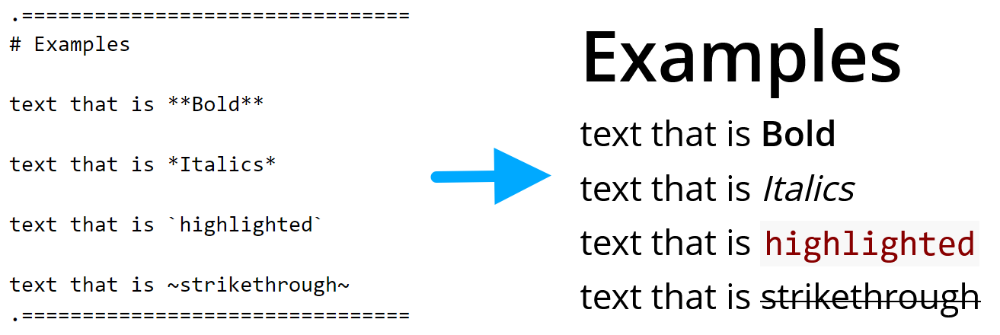
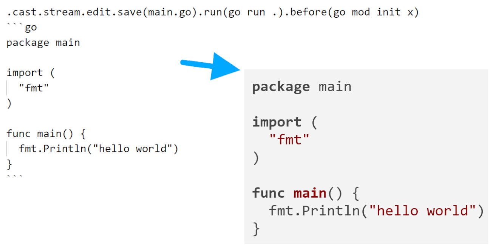

<!--- WARNING --->
<!--- THIS FILE IS AUTOGENERATED --->
<!--- edit files in /doc folder --->
<!--- execute task generate to update this file --->

# present

# 
<!--- image created with https://www.quasilyte.dev/gopherkon/?state=000a070k03040100000000000000000000 --->

tool for viewing presentations written in markdown like format

slides are written in text friendly format and follow all standard
markdown rules with some additions

main purpose of application is:
- view presentation in browsers
- have option to run code directly from presentation
  - support for any language, no sandbox, "run on your machine principle"

## Installation
Use the following command to download and install this tool:
```sh
go install github.com/oktalz/present@latest
```

## Binaries
  prebuilt binaries can be found on [releases](https://github.com/oktalz/present/releases) page

## Running

- enter examples folder, type `present`
  - program should read all files and start web server on port 8080 (default)
    - port can be customized (see `present.env` file)
- run `go run . -d /path/to/files`
- run `go run . -g github.com/oktalz/present -d examples/go1.23`
  - for `gitlab.com` and `github.com` project url is detected, for others use full path `-g https://github.com/oktalz/present.git`
  - this will download repository, enter directory (if specified) and start server

## Arguments

- list of all arguments can be seen with `present --help`

```txt
NAME
  present

FLAGS
  -v, --version                 show version
  -h, --host STRING             address that present will listen on (default: 127.0.0.1)
  -p, --port INT                port that present will listen on (default: 8080)
  -t, --tag                     show tag
  -c, --compress STRING         compress current folder
  -f, --file STRING             file to open (.tar.gz format)
  -g, --git STRING              git repository URL
      --key STRING              ssh key used for git clone auth
  -d, --dir STRING              directory to open
      --help                    help
      --admin-pwd STRING        admin password
      --user-pwd STRING         user password
      --admin-pwd-disable       disable admin password
      --menu STRING             keys that opens menu
      --next-page STRING        keys that go to next page
      --previous-page STRING    keys that go to previous page
      --terminal-cast STRING    keys that run commands
      --terminal-close STRING   keys that closes terminal
      --latest                  update to latest version if go is installed

```

## Sharing presentations

- enter presentation folder
- type `present -c` - present.tar.gz will be created
- send file
  - user can start presentation with `present -f present.tar.gz`
  - user can unpack file, enter folder and execute `present`

## Browser paths

when presentation is opened in browser few paths exists:
- `/` -> show presentation in selected aspect ratio
- `/print` -> presentation without forced aspect ratio (use for printing)
- `/login` -> path to log in admin credentials
- `/stats` -> path to log in admin credentials

## Customizations & security

- present will watch for three files:
  - `present.env` in active directory (this will not override already existing ENV values)
  - `.env` in active directory (this **will** override already existing ENV values)
  - `present.env` in user HOME directory (this **will** override already existing ENV values)
- `.env` file or corresponding variables can be used to customize behavior
  ```txt
  ADMIN_PWD=AdminPassword123
  USER_PWD=user
  PORT=8080
  NEXT_PAGE=ArrowRight,ArrowDown,PageDown,Space,e
  PREVIOUS_PAGE=ArrowLeft,ArrowUp,PageUp
  TERMINAL_CAST=r,b
  TERMINAL_CLOSE=c
  MENU=m
  ```
- if `ADMIN_PWD` is set, only users authorized with that password can execute the code
  - if `ADMIN_PWD` is not provided, it will be generated and written on console
    - with `ADMIN_PWD_DISABLE=true` you can remove need for admin password
  - admin password can be entered on `/login` url (for example http://localhost:8080/login)
- if `USER_PWD` is set, all 'users' will need to enter password to see the presentation
- rest are pretty self explanatory (also in examples are defaults for all options)

## IDE - syntax highlighter & code snippets

- syntax highlighting is both available for VS Code and VSCodium

  - [Visual Studio Code Marketplace](https://marketplace.visualstudio.com/items?itemName=ZlatkoBratkovic.vscode-oktalz-present)

  - [Open VSX Marketplace](https://open-vsx.org/extension/ZlatkoBratkovic/vscode-oktalz-present)

## Examples

- please see (and run) examples in [examples](examples) folder

- simple styling


- display code that is editable and runnable

